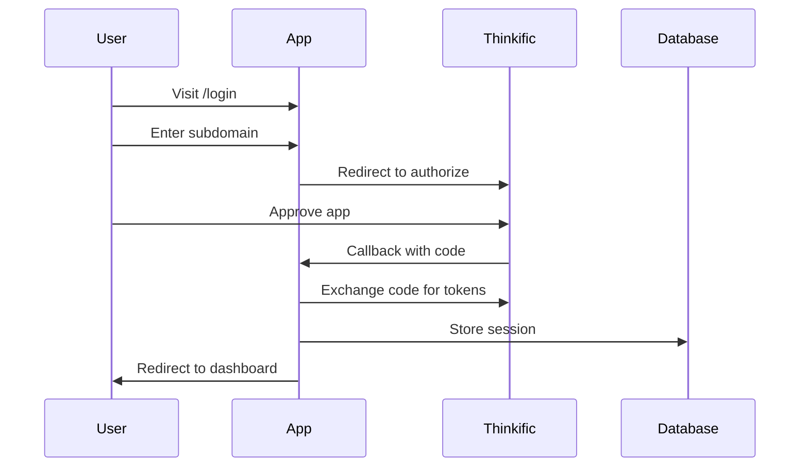

# Learn Alchemy - Thinkific App Starter

A production-ready starter repository for building Thinkific apps with OAuth integration, GraphQL API support, and session management.

## Features

- **OAuth 2.0 Authentication** - Complete OAuth flow with automatic token refresh
- **GraphQL Client** - Pre-configured client for Thinkific's GraphQL API
- **Session Management** - Prisma + SQLite for secure token storage
- **Modern Stack** - Next.js 16, React 19, TypeScript, Chakra UI v3
- **Clone & Deploy** - Get started in minutes with minimal configuration

## Quick Start

### 1. Clone the Repository

```bash
git clone https://github.com/your-username/learn-alchemy.git
cd learn-alchemy
```

### 2. Install Dependencies

```bash
npm install
```

### 3. Configure Environment Variables

Copy the example environment file:

```bash
cp .env.example .env.local
```

Edit `.env.local` with your credentials:

```env
THINKIFIC_CLIENT_ID=your_client_id
THINKIFIC_CLIENT_SECRET=your_client_secret
THINKIFIC_REDIRECT_URI=http://localhost:3000/api/auth/callback
DATABASE_URL="file:./dev.db"
NEXTAUTH_SECRET=your_random_secret
```

### 4. Set Up the Database

```bash
npx prisma generate
npx prisma db push
```

### 5. Run the Development Server

```bash
npm run dev
```

Open [http://localhost:3000](http://localhost:3000) to see your app.

## Thinkific App Registration

Before using this starter, you need to register an app in the Thinkific Partner Portal:

1. **Create a Partner Account**
   - Go to [Thinkific Partners](https://www.thinkific.com/partners/)
   - Sign up for a partner account

2. **Create a New App**
   - Navigate to the Apps section in your Partner Dashboard
   - Click "Create App"
   - Fill in your app details

3. **Configure OAuth Settings**
   - Set your **Callback URL** to match `THINKIFIC_REDIRECT_URI`
     - Local: `http://localhost:3000/api/auth/callback`
     - Production: `https://your-domain.com/api/auth/callback`
   - Copy your **Client ID** and **Client Secret**

4. **Set OAuth Scopes**
   - Select the appropriate scopes for your app
   - Common scopes: `read:site`, `read:courses`, `read:users`

5. **Configure Webhooks (Optional)**
   - Add uninstall webhook: `https://your-domain.com/api/auth/uninstall`

## Project Structure

```
learn-alchemy/
├── app/
│   ├── (auth)/              # Auth-related pages
│   │   └── login/           # Login page with subdomain input
│   ├── (dashboard)/         # Protected dashboard pages
│   │   ├── dashboard/       # Main dashboard
│   │   └── layout.tsx       # Dashboard layout with auth check
│   ├── api/
│   │   ├── auth/
│   │   │   ├── authorize/   # Initiates OAuth flow
│   │   │   ├── callback/    # Handles OAuth callback
│   │   │   └── uninstall/   # Handles app uninstall webhook
│   │   └── graphql/         # GraphQL proxy endpoint
│   ├── layout.tsx           # Root layout with providers
│   ├── page.tsx             # Home page (redirects)
│   └── providers.tsx        # Chakra UI + React Query providers
├── lib/
│   ├── auth.ts              # Authentication utilities
│   ├── graphql.ts           # GraphQL client factory
│   ├── prisma.ts            # Prisma client singleton
│   └── queries/
│       └── site.ts          # Example GraphQL queries
├── prisma/
│   └── schema.prisma        # Database schema
└── .env.example             # Environment template
```

## Authentication Flow



## Making GraphQL Requests

### Server-Side (Server Components)

```typescript
import { createThinkificClient } from '@/lib/graphql';
import { GET_COURSES } from '@/lib/queries/site';

export default async function CoursesPage() {
  const client = createThinkificClient('your-subdomain');
  const data = await client.request(GET_COURSES, { first: 10 });
  
  return <div>{/* render courses */}</div>;
}
```

### Client-Side (via API Route)

```typescript
const response = await fetch('/api/graphql', {
  method: 'POST',
  headers: { 'Content-Type': 'application/json' },
  body: JSON.stringify({
    query: `query { site { name } }`,
  }),
});

const { data } = await response.json();
```

## Deployment

### Deploy to Vercel

1. Push your code to GitHub
2. Import the repository in [Vercel](https://vercel.com)
3. Add environment variables in Vercel dashboard
4. Update `THINKIFIC_REDIRECT_URI` to your production URL
5. Deploy!

### Deploy to Railway

1. Connect your GitHub repository to [Railway](https://railway.app)
2. Add environment variables
3. Railway will automatically detect Next.js and deploy

### Important: Update Callback URL

After deploying, update your Thinkific app's callback URL to match your production domain:

```
https://your-app.vercel.app/api/auth/callback
```

## Tech Stack

| Technology | Version | Purpose |
|------------|---------|---------|
| Next.js | 16 | React framework with App Router |
| React | 19 | UI library |
| TypeScript | 5.x | Type safety |
| Chakra UI | v3 | Component library |
| Prisma | 6.x | Database ORM |
| SQLite | 3.x | Session storage database |
| graphql-request | Latest | GraphQL client |
| TanStack Query | v5 | Server state management |
| Zod | Latest | Schema validation |

## API Reference

### Thinkific API Endpoints

- **OAuth Authorization**: `https://app.thinkific.com/oauth2/authorize`
- **Token Exchange**: `https://app.thinkific.com/oauth2/token`
- **GraphQL API**: `https://api.thinkific.com/graphql`

### Required Headers for Thinkific API

```typescript
{
  'Authorization': `Bearer ${accessToken}`,
  'X-Thinkific-Subdomain': subdomain,
  'Content-Type': 'application/json',
}
```

## Contributing

Contributions are welcome! Please open an issue or submit a pull request.

## License

MIT
